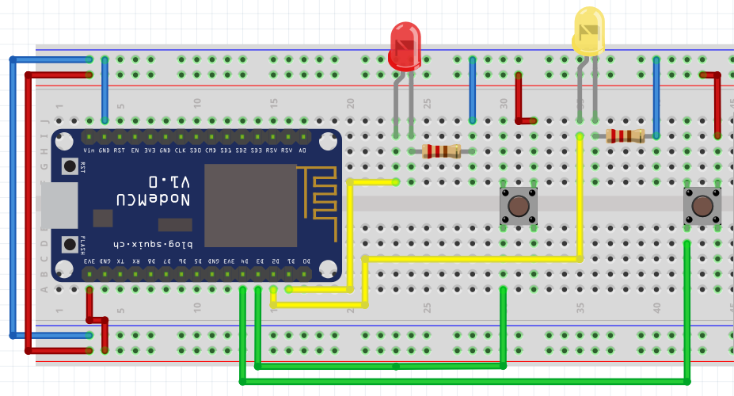
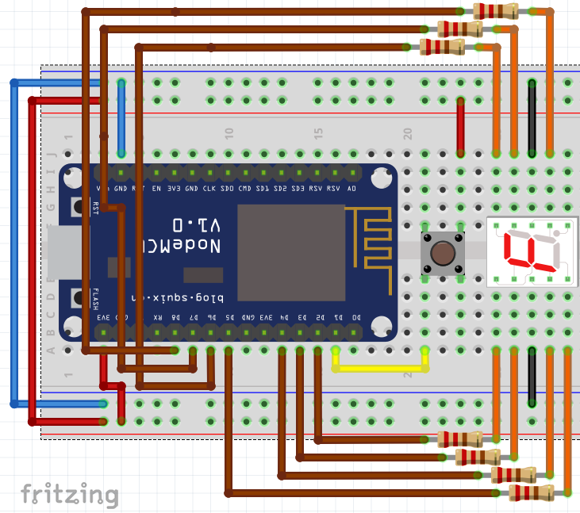

# Practicas

## 1. Control de salidas
   
### 1.1. Encender LED

### 1.2 Encender 2 LEDs

## 2. Control de entradas

### 2.1 Leer push button y encender led

### 2.2 Leer 2 push button y encender 2 leds

## 3. Estructura de disicion (IF)

### 3.1 Toggle button
 

### 3.2 Contador básico

#### Display

### 3.3 Automático

### Con botón

### DTH11 Sensor de temperatura y humedad

### Sensor de flama

## Prácticas con ADC

### Leer un potenciometro

### LM35 (Temp)

### Sensor de sonido (ADC)
