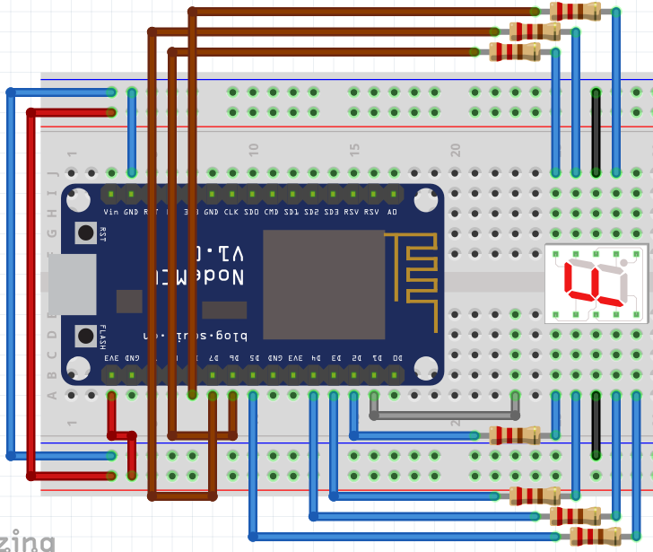

# Prácticas

## 1. Control de salidas
   
### 1.1. Encender LED

Descripción| Materiales | Diagrama pictórico 
-|-|-
1.1.1 Configuración de salidas desde archivo|1 Led 1 R220|
1.1.2 Manejo de terminal y configurando pines|1 Led 1 R220|

### 1.2 Encender más LEDs

Descripción| Materiales | Diagrama pictórico 
-|-|-
1.2.1 Control de más salidas y su configuración|2 Led 2 R220|
**1.2.2 Control de más salidas y su configuración**|x Led x R220|
1.2.3 Parpadear LED con un intervalo de un cuarto de segundo (**tmr**) |2 Led 2 R220|
**1.2.4 Parpadear LED con un intervalo de medio segundo y de un segundo** (**tmr**)|2 Led 2 R220|
1.2.5 Realizar un **semaforo** sencillo |3 Led 3 R220|
**1.2.6 Realizar dos semáforos en una intersección, deben trabajar complementariamente**|3 Led 3 R220|

## 2. Control I/O (If)

### Operadores de relación

Nombre | Símbolo | Sintaxis
-|-|-
Mayor que|**>**| 3 > 1
Mayor o igual que|**>=**| 3 >= 1
Menor que|**<**| 3 < 1
Menor o igual que|**<=**| 3 > 1
Igual que|**==**| 4 == 4
Diferente de|**~=**| 4 ~= 4

### 2.1 Leer push button y encender led

Descripción| Materiales | Diagrama pictórico 
-|-|-
2.1.1 Leer una entrada digital, encenderá el LED mientras se mantenga presionado el push button|1 Led 1 R1k 1 R220 1 push button|
**2.1.2 Mientras se presione el botón los LEDs deben parpadear medio segundo**|1 Led 1 R1k 1 R220 1 push button|
2.1.3 Control de 2 leds por medio de un push button; mientras se mantiene presionado el push button deben estar encendidos los leds, de lo contrario estrán apagados |2 Led 2 R1k 1 push button|
2.1.4 Control de 2 leds, cada uno con su propio push button, mientras sea presionado el push button debe matenerse encendido su respectivo LED|2 Led 2 R1k 1 push button|
2.1.5 **Toggle**: Al presionar el push button se debe encender el led y mantenerce en ese estado; hasta que se vuelva a presionar el led regresará a su estado anterior|2 Led 2 R1k 1 push button|
2.1.6 **Toggle**: Control de 2 leds, cada uno con su propio push button, al presionar el push button se debe encender su respectivo led y mantenerce en ese estado; hasta que se vuelva a presionar el led regresará a su estado anterior|2 Led 2 R1k 1 push button|

### 2.2 Operadores lógicos

Nombre | Símbolo | Sintaxis
-|-|-
Compuerta And|**and**| (3 > 4) and (1 == 1)
Compuerta OR|**or**| (4 < 5) or (5 ~= 3)
Compuerta NOT|**not**| not (5 < 2)

Descripción| Materiales | Diagrama pictórico 
-|-|-
2.2.1 Control de 2 leds, cada uno con su propio push button, mientras sea presionado el push button debe parpadear a 1/4 de segundo, encendido su respectivo LED|2 Led 2 R1k 1 push button|
2.2.2 Control de 2 leds, cada uno con su propio push button, mientras sea presionado el push button debe parpadear a 1/4 de segundo, encendido su respectivo LED; en caso que sean presionados ambos push button al mismo tiempo los leds van a parpadear juntos cada 200mS|2 Led 2 R1k 1 push button|

## 3 Display de 7 segmentos

#### Display

Display de 7 segmentos puede ser de ánodo o cátodo común; existen displays con mayores segmentos, hasta una matriz de puntos de diferentes resoluciones.

Descripción| Materiales | Diagrama pictórico 
-|-|-
3.1.1 Creación de un contador básico con un display de 7 segmentos, el cual comenzará en 0 y terminará en F, haciendo un conteo hexadecimal, el intervalo de tiempo será de medio segundo|1 display de 7-segmentos, una vez que termine se reinicia automáticamente 7 R220|
**3.1.2 Creación de un contador básico con un display de 7 segmentos, el cual comenzará en 0 y terminará en F, haciendo un conteo hexadecimal, el intercambio de digito será atraves de un push button**|1 display de 7-segmentos 7 R220 1 push button 1 R1k|
**3.1.3 Crear un mensaje que se vaya leyendo en el display de 7 segmentos que diga "HOLA", el intervalor de cada letra será de medio segundo**|1 display de 7-segmentos 7 R220 1 push button 1 R1k|
**3.1.4 Crear un mensaje que se vaya leyendo en el display de 7 segmentos, *tu elijes la palabra o frase*, el intervalor de cada letra será de medio segundo**|1 display de 7-segmentos 7 R220 1 push button 1 R1k|
3.1.5 Creación de un contador básico con un display de 7 segmentos, el cual comenzará en 0 y terminará en F, el cambio se hará cada vez que sea presionado un push button|1 display de 7-segmentos 7 R220 1 push button 1 R1k|

## 4 Control de motores

- Control de un motor DC

## 5 Ciclos (while)

- Secuencia de luces
- 7 segmentos con valores guardados

## 6 Protocolos digitales

- LCD (Mensajes)
- DTH11

## 7 Entradas ánalogicas (ADC)

- Mostrar temperatura(LM35) en LCD
- Control de motores DC en la pantalla

## 8 Salidas ánalogicas (PWM)

- Control de un motor DC
- Posición de un servo
- Led RGB

<!-- TODO: Ejercicios con arrays
x.x.x... En memeria se contendrán diferentes mensajes, y cada vez que se presione el push button, debe cambiar el mensaje, los mensaje son:  -**"cbtis-85"** - **"coatza" - *Tu creas tu propio mensaje*|1 display de 7-segmentos 7 R220 1 push button 1 R1k| -->

# Revisar el manual y ver que otras practicas se pueden hacer antes de entrar a sensores

### DTH11 Sensor de temperatura y humedad

### Sensor de flama

## Prácticas con ADC

### Leer un potenciometro

### LM35 (Temp)

### Sensor de sonido (ADC)
